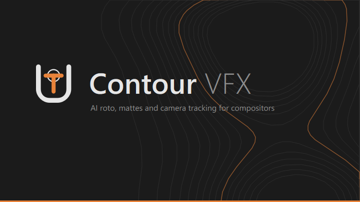

<p align="center">
  
</p>

# Contour VFX

**AI roto, mattes and camera tracking for compositors.** A node-based Windows desktop app that runs current AI models (SAM, ViTMatte, MEMatte, CorridorKey, Depth Anything, COLMAP) on your plates and hands the results to Nuke.

## What it does
Wire nodes together, render, and take the results into Nuke or Blender. Everything runs on your machine: after setup the app never downloads anything and never uploads a frame.

| Node | What it gives you |
|---|---|
| **Media Plate** | EXR/DPX/TIFF/PNG sequences or video. Keeps the original for delivery and makes a 16-bit display copy for the AI nodes; ACES, log and video colour spaces; optional half-size working copy for 4K. |
| **SuperMatte** | Click, box or text prompts; SAM 1, SAM 2 (SAMURAI tracking) or SAM 3, refined with ViTMatte, MEMatte or VideoMaMa into soft 16-bit mattes, one per layer. |
| **Matte to Shape** | Mattes turned into Nuke roto shapes whose points stay on the object, with feather. Outline mode for any object; body-parts mode cuts a person into head, torso and limbs from their skeleton, and limbs behind the body fade out using the depth map. |
| **Corridor Keyer** | Green/blue screen keying with CorridorKey: straight or premultiplied linear EXR, despill, matte clean-up, anti-flicker. |
| **Depth** | Depth Anything V2: stable relative depth (0-1 over the shot) or metric depth in metres, as float EXR. |
| **Grade**, **OCIO ColorSpace** | Nuke-style grade and OpenColorIO conversions in scene-linear, on the full-quality frames. |
| **3D Camera Tracker** | COLMAP 4.2 solve (global or incremental) with SIFT, LightGlue, ALIKED or LoMa features; ignores moving objects given a matte. |
| **Unified Output** | Delivers everything: EXR layers (colour in ACEScg or another linear space, mattes in A, depth in Z), camera for Nuke/Blender/USD, roto shapes, a Nuke script with a Read per layer. |

**Conventions**
- **Colour:** the ACES studio OpenColorIO config. The working space is ACEScg and the viewer uses the ACES SDR view. Highlights above 1.0 are kept.
- **Frame numbers:** every file keeps the plate's own frame numbers (1001 stays 1001). The timeline's In/Out limits every render.
- **Rendering:** renders are cached per node and redone only when something upstream changes. Stop, Freeze and Bypass work as in Nuke. Renders can also run without the window; see [Rendering without the window](#rendering-without-the-window).

Model weights (about 27 GB) and the COLMAP/FFmpeg binaries are not in the repository; `first_setup.py` downloads them (see below and [MODEL_DOWNLOADS.md](MODEL_DOWNLOADS.md)).

## Requirements and installation
Windows 10/11 x64 and an NVIDIA GPU with a CUDA 12.1-capable driver. About 30 GB of disk for the models.

There is one supported way to install: `first_setup.py`. `install.bat` is a thin wrapper that finds a suitable Python and runs it.

1. Clone the repository with its submodules:
   ```bat
   git clone --recurse-submodules --shallow-submodules https://github.com/capsuleutkarsh-design/UTVFX_AI_VFX_Suit.git
   cd UTVFX_AI_VFX_Suit
   ```
   Clone into a short folder such as `C:\Contour` or your Documents folder. Windows limits paths to 260 characters, and a very deep folder makes the CorridorKey submodule fail with "Filename too long" (or run `git config --global core.longpaths true` first).
2. Run the installer:
   ```bat
   install.bat
   ```
   It looks for Python **3.10 or 3.11**, in this order: an existing `python_base\python.exe`, the `py` launcher (`py -3.11`, `py -3.10`), [uv](https://docs.astral.sh/uv/) (`%USERPROFILE%\.local\bin\uv.exe`, which fetches Python 3.10 by itself), then `python` on `PATH`. Python 3.12 and newer are refused: `torch 2.5.1+cu121` and `mediapipe<0.10.10` have no wheels for them. With Python 3.10/3.11 already installed you can run `python first_setup.py` directly instead.

   `first_setup.py` then:
   - updates the git submodules;
   - creates `python_base\`, a portable CPython 3.10.11 (python.org embeddable build, SHA-256 checked, pip bootstrapped from a hash-checked wheel);
   - installs the exact package versions in `requirements-lock.txt` into it (PyTorch comes from the CUDA 12.1 index);
   - downloads the models and binaries: every file is pinned (Hugging Face commit or fixed release URL) with a SHA-256 and size, is written to `<name>.part` first and only renamed once complete and verified. This includes FFmpeg 9.0.2 and COLMAP 4.2.0 (CUDA build, with the GLOMAP global mapper built in) for the 3D Tracker.

   Re-running it is safe: finished items are skipped and an interrupted download resumes. Useful options: `--check` (report only, change nothing), `--verify` (hash every file already present), `--skip-deps`, `--skip-models`. MEMatte weights still have to be downloaded by hand, see [MODEL_DOWNLOADS.md](MODEL_DOWNLOADS.md).
3. Start the app:
   ```bat
   run.bat
   ```

### Rendering without the window
`render.bat` renders a saved project from the command line, for batches or a render machine. The results and caches are the same as in the app, and nothing is uploaded.

```bat
render.bat shot.contour
render.bat shot.contour --node Depth1 --frames 1001-1050
render.bat shot.contour --list
```

With no `--node`, every Unified Output node is rendered, together with everything it needs. `--frames` takes plate frame numbers (like the timeline's In/Out), `--relink FOLDER` finds plates that have moved, and `--quiet` prints only progress and errors. Progress shows the time left. Exit codes: 0 all done, 1 a render failed or was stopped (Ctrl+C stops cleanly), 2 bad arguments or project.

`requirements.txt` is the loose list of top-level packages with their tested version ranges. To change a dependency, edit it, install into `python_base`, run the tests (`python_base\python.exe -m pytest -q`), then regenerate the lock with `python_base\python.exe -m pip freeze` (keep only `opencv-contrib-python`, never `opencv-python` as well).

### Offline installs
Missing models can also be installed from a ZIP (`scripts\build_models_zip.py` builds one) with **AI models > Install from offline ZIP** in the app. Only data files under `models/` are taken from the ZIP; code files, `plugins/` and paths outside `models/` are skipped and listed.

### Troubleshooting: manual FFmpeg installation
If FFmpeg does not download (for example an SSL error such as `[SSL: WRONG_VERSION_NUMBER]`):
1. Download [ffmpeg-9.0.2-essentials_build.zip](https://www.gyan.dev/ffmpeg/builds/packages/ffmpeg-9.0.2-essentials_build.zip) (SHA-256 `60f467265b1e312373dbcd92200c2618a74850f98d3d078e94296bb3fa2047ba`).
2. Copy `bin\ffmpeg.exe` from the ZIP to `plugins\3DTracker\bin\ffmpeg.exe`.

## Building the installer
Double-click `build\BUILD.bat` (needs a set-up checkout and [Inno Setup 6](https://jrsoftware.org/isdl.php)). It writes `build\Output\ContourVFX_Setup_<version>.exe` plus `.bin` slices; ship them together. The installer includes the app and its Python environment, and offers to download the models on its last page. Details in [build/README.md](build/README.md).

## Author
Designed and authored by [capsuleutkarsh-design](https://github.com/capsuleutkarsh-design).

## License
Free to use, for personal or professional work, under the [Contour VFX Share-Back Licence](LICENSE). One condition: **if you change the app, send your changes back**, as a pull request or issue here, or by email to capsuleutkarsh@gmail.com. The images, mattes, cameras and roto you make with it are yours to use as you like.

Third-party code, programs and AI models keep their own licences; see [THIRD_PARTY_NOTICES.md](THIRD_PARTY_NOTICES.md). Some models (CorridorKey, GVM, VideoMaMa, Depth Anything V2 Base/Large) allow non-commercial use only, and those limits still apply.

## Contributing
Changes are welcome, and under the licence they have to come back here. Open a pull request (run `python_base\python.exe -m pytest -q` first) or an issue with a patch, or email the changes. Please do not attach footage: describe problems with frame numbers, sizes and log output instead.
